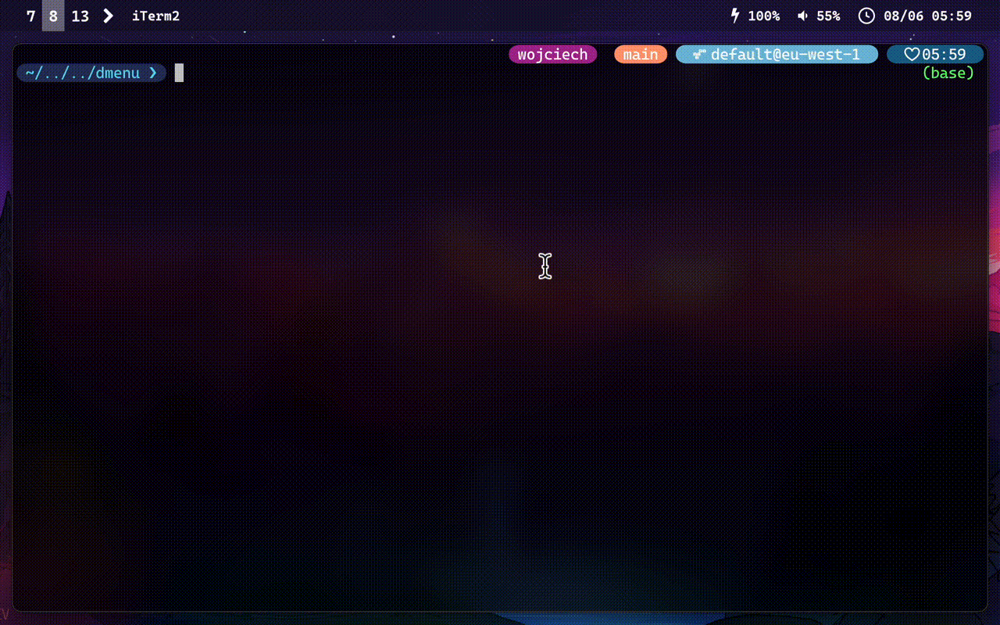

# dmenu

A `dmenu`-like extension for Raycast.

Inspired by [this orange website commenter](https://news.ycombinator.com/item?id=40606300).

## Usage

1. [Install the extension.](#installation)
2. Download the [dmenu_raycast](./dmenu_raycast) script and put it somewhere in your `$PATH`
3. Run something like `printf 'one\ntwo\nthree' | dmenu_raycast`

`dmenu_raycast` will either print the selected item to stdout, or exit 0 if the user cancelled without selecting an item.

[](./screencast.mp4)

Whitespace is stripped, but this might change in the future once I check if `dmenu` also does that lol.

```
usage: raycast_dmenu [-h] [-p PROMPT]

dmenu-like raycast extension

Provide option list as stdin, the stdout will contain the chosen option.
If no option was chosen, the program will exit with the return code set to 1.

options:
  -h, --help            show this help message and exit
  -p PROMPT, --prompt PROMPT
                        search bar placeholder text
```

## Installation

From source:

```shell
git clone https://github.com/irth/dmenu_raycast
cd dmenu_raycast
npm install
npx ray build -e dist -o dist
open raycast://extensions/raycast/developer/import-extension
```

In Raycast, navigate to the "dist" that `npx ray build -e dist -o dist` created
and choose it.

Now, link the `dmenu_raycast` script to somewhere in your `$PATH`, for example

```
sudo ln -s $(pwd)/dmenu_raycast /usr/local/bin/
```

or

```
ln -s $(pwd)/dmenu_raycast ~/.local/bin
```
